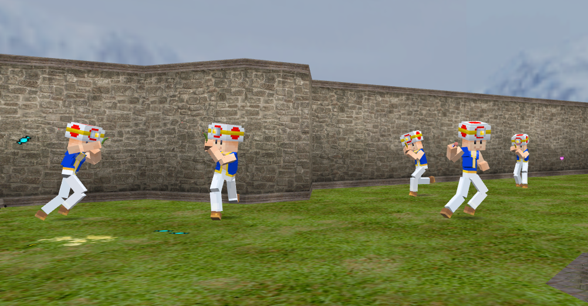
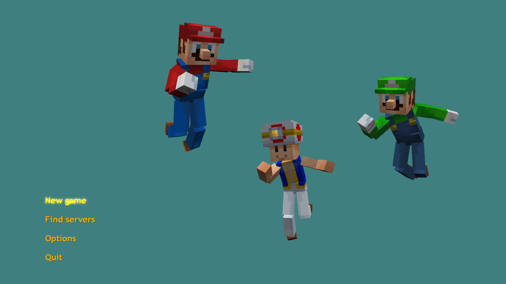
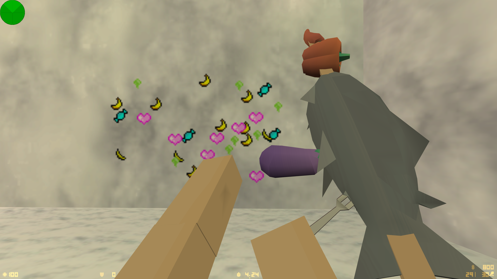
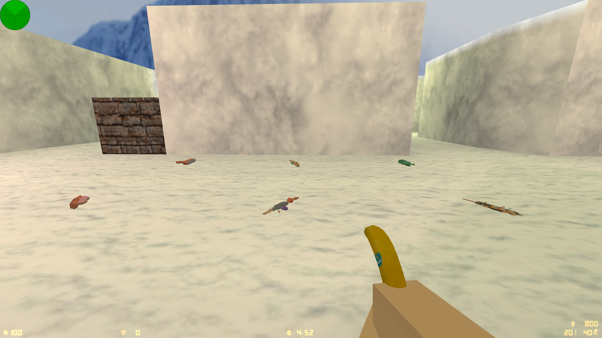

# Food-Blast

Food-Blast is a mod (or a collection of assets) for Counter-Strike 1.6 that aims to remove all form of violence from the game.
This mod can be played on all CS 1.6 servers - even on servers that don't have this mod installed.

## Prerequisites

* [Counter-Strike 1.6](https://store.steampowered.com/app/10/CounterStrike/)

## Installation

Follow these steps to install FoodBlast

**Warning! some of the values in `config.cfg` will be overwritten. Make a backup of your config if you have changes you would like to keep.**

1. Download [the latest release](https://github.com/TheRealBlueRazz/FoodBlast/releases) and unpack it to a folder of your choice
2. Exit steam
3. Run install-food-blast.cmd and follow the instructions
4. Start steam and launch the game

## Screenshots

## TODO

* Replace all sounds with less violent ones
* Specify exact assets used from gamebanana in the Credits

## Credits

|  |
|------|
| [Kenney](https://kenney.nl/) |
| [Gamebanana](https://gamebanana.com/) |
